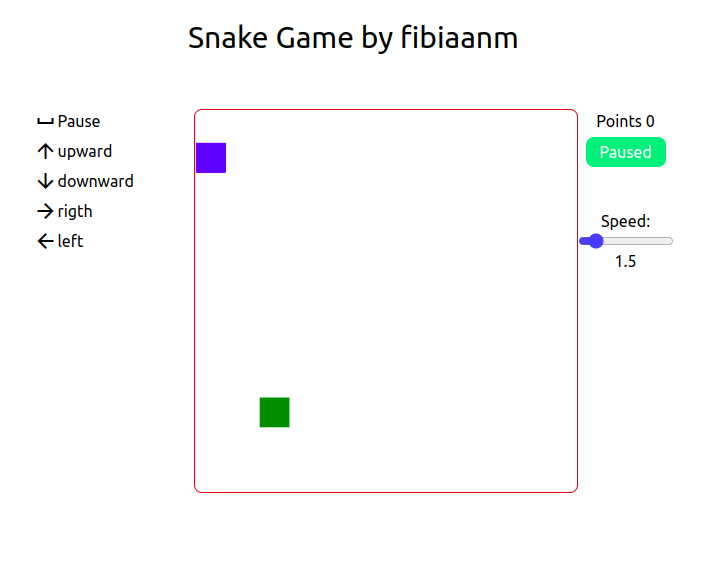

# Snake game demo project

### How to run?
use `yarn dev` or `npm run dev` command to start the application on `localhost:3000`

### Objective
This application is being developed to practice and improve some concepts about design patterns.

#### Application context
The application instance has been done using the singleton design patter and a function helper, to simplify the call proccess. That means you don't need to call the `Class.GetInstance()` method to access to the instance, it is just required to call the `app()` function.

#### Logs
The logs system is built using a class full of static methods. There are some `debug` options to only print messages when the application is on local environment. This also allows to handle errors and send feedback to product.

### Preview
